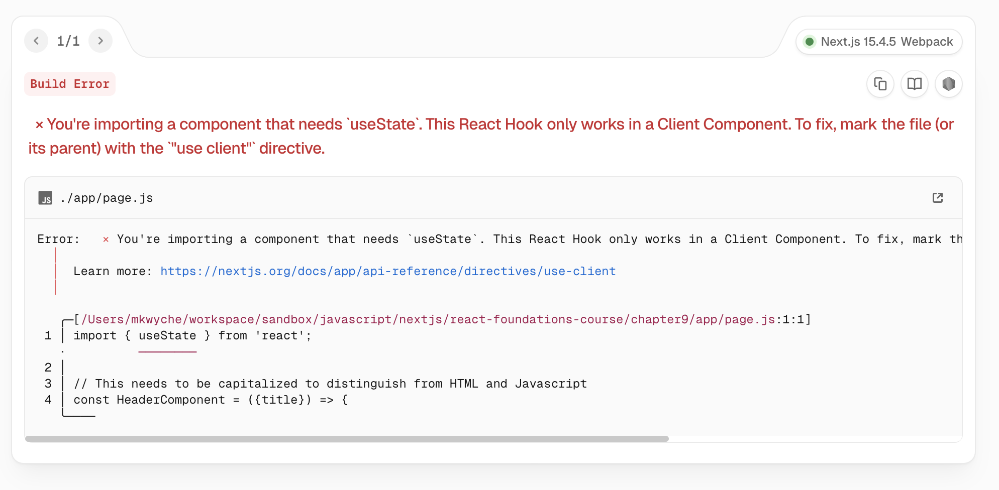

# NextJS React Foundations Course

Going through this as a refresher course. It's been a bit.

## Bookmark

[Current Chapter 9](https://nextjs.org/learn/react-foundations/installation)

## Notes

### Chapter 4

* Why can't I do `<script src='insert package' />` on the imports of javascript packages

### Chapter 9

* Updating Node on Mac

```bash
# NVM is being managed by homebrew for now but nvm doesn't suggest this.
# Installed the minimum version for tutorial since I need to upgrade OS to get latest version
nvm install 18.19.1
```
* Run the app using the following command:
```
npm run dev
```
* Chapter ends with route in a broken state.


